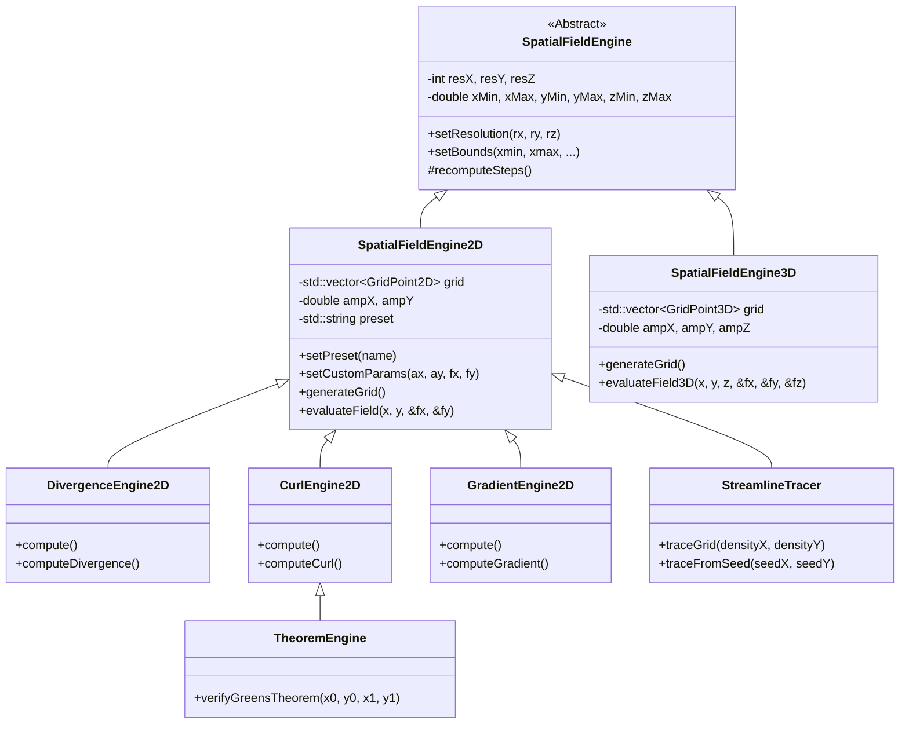
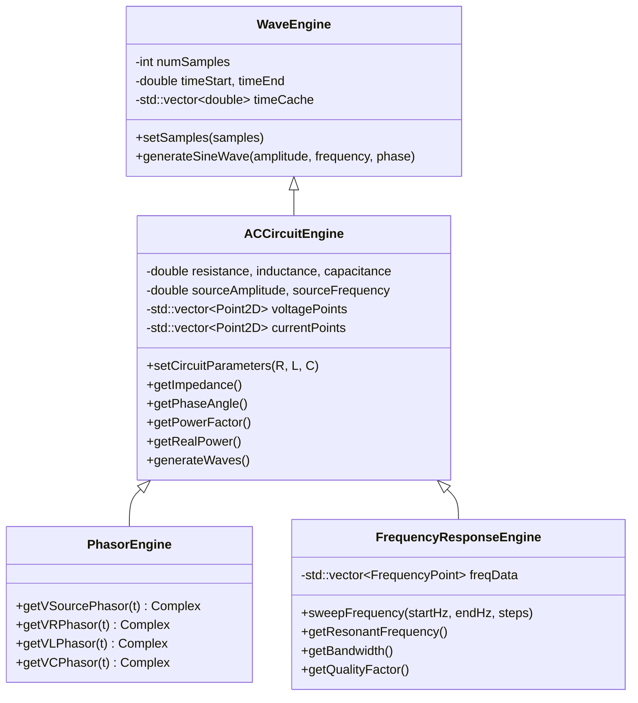
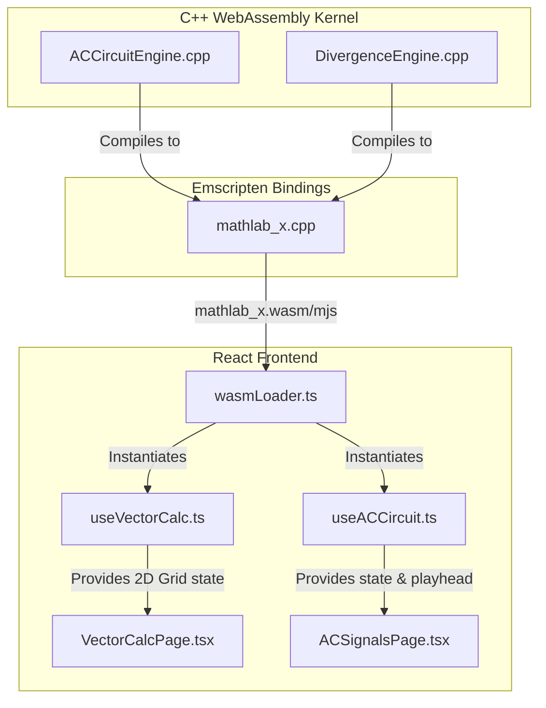

# MathlabX Engine Architecture

This document provides a high-level overview of the MathlabX architecture, mapping the High-Performance C++ kernel (WASM) to the React TypeScript frontend hooks.

## Spatial Field Engine Hierarchy (2D / 3D Vector Calculus)

This hierarchy handles the spatial computations (Divergence, Curl, Gradient) and traces streamlines or verifies theorems. The engines utilize a dual-path execution strategy (SIMD for supported hardware, standard OOP for scalar fallbacks).

## AC Time-Domain Engine Hierarchy (Circuits & Phasors)

This hierarchy manages the mathematical waveforms for the AC Circuit analysis, evaluating time-based parameters over arrays of sequential data.

## React Frontend Integration

The Emscripten bindings convert the above C++ classes to JavaScript classes. The React hooks then wrap these JS classes to provide reactive states to the UI.

